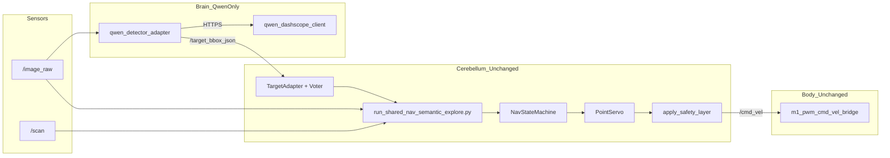

# Qwen 替换 YOLO 接口分析报告（修订版）

> 仓库：`/root/rdk_x5_vln_robot`  
> 目标：不重建 `/root/rdk_x5_qwen_vln_robot` 平行系统，仅在原仓库把 **YOLO 感知层** 替换为 **Qwen 云端视觉大脑**，复用已有相机、雷达、底盘 bridge、视觉伺服、FSM、LiDAR 安全、到达判定；P2 再接入语义探索与 Nav2/SLAM。  
> **本文档为接口分析与实施规范；P0 实施时只新增 4 个文件，不修改主导航节点、YOLO、底盘、SLAM 脚本。**

---

## 0. 接口方案有效性与效率评估

### 0.1 有效性：**高**

| 判断依据 | 说明 |
|----------|------|
| 单一感知话题 | 下游 `run_shared_nav_semantic_explore.py` 仅订阅 `/target_bbox_json`（`bbox_cb` → `TargetAdapter`），与 YOLO 发布话题完全一致 |
| 像素坐标契约 | `PointServo` 用 `u` 像素算 `ex`；Adapter 输出像素 `u/v/cx/cy` 与 YOLO 一致，无需改伺服 |
| 已有适配器 | `TargetBBoxParser` / `ingest_yolo_bbox_json()` 已解析 `bbox`、`cx/cy`、`score`、`visible` |
| 进程边界清晰 | Adapter **只发感知**；`cmd_vel` 仍仅 shared_nav 发布，避免双发布者冲突 |
| P0 范围可控 | 关 semantic_explore / Nav2 / SLAM，链路缩短为「相机 → Qwen → bbox_json → shared_nav → 底盘」 |

**结论：** 用 Adapter 冒充 YOLO 发布者是正确、可落地的替换方式；比平行新建 `run_qwen_api_lidar_nav` 全栈更符合「大脑换、小脑不换」。

### 0.2 效率：**感知层偏低、系统层合理**

| 维度 | YOLO（现网） | Qwen Adapter（P0） | 评价 |
|------|-------------|---------------------|------|
| 检测频率 | 8–10 Hz（BPU） | ~0.5–1 Hz（云 API + interval） | 感知慢一个数量级 |
| 端到端延迟 | tens of ms | 0.6–2 s / 次 | 不适合极速避障，靠 LiDAR 安全层补 |
| 算力占用 | 占 BPU/CPU | 主要网络 I/O + JPEG 编码 | 板端更轻，成本在云 |
| 控制频率 | shared_nav 20 Hz 不变 | 不变 | **小脑效率不受影响** |
| 开发效率 | — | 只写 4 个新文件 | 改动面最小 |

**结论：** 接口设计在**系统架构上高效**（最小侵入、最大复用）；在**感知刷新率上不如 YOLO**，需依赖下游 `MultiFrameTargetVoter` hold、`lost_target_servo_sec`、以及 P1 的 Adapter 内 hold/smooth 弥补。P0 用 LiDAR 主导到达（`min_area_ratio/min_height_ratio` 置无效阈值）是务实做法，避免伪 bbox 误导 FSM。

### 0.3 主要有效性前提（实施时必须满足）

1. `/target_bbox_json` **同时只有一个发布者**（Qwen 或 YOLO，不能并存）。
2. 发布 JSON 中 **`u/v/cx/cy` 必须是像素坐标**（见 §5.3）。
3. P0 **`success.min_area_ratio` / `min_height_ratio` 设为 999**，到达走 LiDAR + 居中，不依赖伪 bbox 面积。
4. `qwen_detector_adapter.py` **禁止**订阅或发布 `/cmd_vel`。

---

## 1. 已检查文件概览

| 类别 | 路径 | 作用 |
|------|------|------|
| **主导航节点（P0 不改）** | `src/apps/run_shared_nav_semantic_explore.py` | bbox_json → FSM → PointServo → LiDAR 安全 → `/cmd_vel` |
| FSM | `src/fsm/nav_state_machine.py` | BOOT → SEARCH → TRACK → ARRIVE_VERIFY → SUCCESS |
| Legacy Qwen | `src/apps/archive_legacy/run_qwen_lidar_nav.py` | 独立闭环，**不接入 shared_nav**，仅借鉴异步推理思路 |
| LiDAR（legacy） | `src/perception/lidar_depth.py` | archive 用；**shared_nav 用 `free_space_waypoint.py`** |
| 视觉伺服 | `src/control/point_servo.py` | 仅需像素 `u` |
| 目标适配 | `src/perception/target_adapter.py` | `ingest_yolo_bbox_json()` 消费 `/target_bbox_json` |
| bbox 解析 | `src/perception/target_bbox_parser.py` | JSON → visible/u/v/bbox/score |
| 多帧投票 | `src/perception/multi_frame_voter.py` | hold + 平滑（需 bbox 字段） |
| YOLO 检测 | `src/perception/yolov5s_bpu_web_node.py` | P0 **不启动**，保留源码 |
| YOLO 桥接 | `src/perception/yolo_world_to_bbox_json.py` | P0 **不启动**，保留源码 |
| 配置（YOLO 生产） | `configs/nav_yolo_lidar_semantic_explore.yaml` | 回退参考 |
| 配置（P0 新建） | `configs/qwen_shared_nav.yaml` | Qwen 栈专用 |
| 启动（YOLO） | `scripts/nav/start_yolo_lidar_semantic_explore_nav.sh` | 回退用，**不修改** |
| 启动（P0 新建） | `scripts/nav/start_qwen_shared_nav.sh` | Qwen 栈启动 |

---

## 2. 原 YOLO 模块输出了什么

### 2.1 话题与消息类型

| 话题 | 类型 | 发布者 |
|------|------|--------|
| `/target_bbox_json` | `std_msgs/msg/String`（JSON 字符串） | YOLO 节点 → **P0 改为 Qwen Adapter** |
| `/target_words` | `std_msgs/msg/String` | shared_nav 定时发布（YOLO-World 用；Qwen P0 可忽略） |

**小脑消费的感知话题：仅 `/target_bbox_json`。**

### 2.2 有目标时的 JSON 示例（像素坐标）

```json
{
  "timestamp": 1730000000.0,
  "visible": true,
  "found": true,
  "source": "yolov5s_bpu",
  "class_name": "bottle",
  "score": 0.85,
  "bbox": [562, 330, 663, 430],
  "bbox_xyxy": [562, 330, 663, 430],
  "cx": 612.5,
  "cy": 380.0,
  "u": 612.5,
  "v": 380.0,
  "area_ratio": 0.08,
  "image_width": 1280,
  "image_height": 720
}
```

**无目标时：**

```json
{
  "visible": false,
  "found": false,
  "source": "qwen_dashscope",
  "reason": "no_target",
  "score": 0.0,
  "image_width": 1280,
  "image_height": 720
}
```

### 2.3 字段能力对照

| 字段 | 必须性（P0） | 说明 |
|------|-------------|------|
| `visible` / `found` | 必须 | 丢失检测 |
| `u` / `v` / `cx` / `cy` | 必须 | **像素坐标**，四者对齐 |
| `score` | 必须 | 置信度 |
| `class_name` | 推荐 | 类别标签 |
| `bbox` | 推荐 | 供 voter；可合成伪 bbox |
| `area_ratio` | 可选 | P0 **不作为到达主条件** |
| `image_width` / `image_height` | 推荐 | 与当前帧一致 |

---

## 3. 小脑控制层需要什么输入

### 3.1 订阅关系

| 订阅者 | 话题 | 用途 |
|--------|------|------|
| `run_shared_nav_semantic_explore.py` | `/target_bbox_json` | `bbox_cb` → `TargetAdapter` |
| `explore_goal_selector.py` | `/target_bbox_json` | **P0 不启动 explore，无订阅** |

**P0 唯一自动 `/cmd_vel` 发布者：** `run_shared_nav_semantic_explore.py`（经 `apply_safety_layer`）。

### 3.2 控制层：bbox vs 中心点

| 模块 | bbox | 像素 u/v |
|------|------|----------|
| `PointServo` | 否 | **是（仅 u）** |
| `MultiFrameTargetVoter` | 是（hold/smooth） | 间接 |
| FSM 到达 `arrive_ok_recent_target` | 可选路径 | 是 + LiDAR |

**P0 到达策略（修订）：** 不靠伪 bbox 的 `area_ratio`/`height_ratio`；在 `qwen_shared_nav.yaml` 将二者阈值设为 `999.0`，使 FSM 到达主要由 **`lidar_success_distance` + 居中 `center_px`** 触发。

### 3.3 P0 数据流（无 explore / Nav2 / SLAM）

```
/image_raw ──► qwen_detector_adapter ──► /target_bbox_json
        │                                        │
        │                                        ▼
        └────────────────────────► run_shared_nav_semantic_explore
                                              │
                    ┌─────────────────────────┼─────────────────────────┐
                    ▼                         ▼                         ▼
             TargetAdapter+Voter          NavStateMachine            PointServo
                    │                         │                         │
                    └─────────────────────────┴─────────────────────────┘
                                              ▼
                                   apply_safety_layer → /cmd_vel
                                              ▼
                                   m1_pwm_cmd_vel_bridge
```

### 3.4 FSM 与到达判定（P0 配置）

`arrive_ok_recent_target()` 逻辑（`nav_state_machine.py`）：

1. 最近见过目标（`target_recent_sec`）
2. `score >= min_score`
3. `|center_error_px| <= center_px`
4. **且** 下列之一成立：
   - `front_distance <= lidar_success_distance` ← **P0 主路径**
   - `area_ratio >= min_area_ratio` ← P0 设为 `999.0` **无效化**
   - `height_ratio >= min_height_ratio` ← P0 设为 `999.0` **无效化**

**P0 推荐 `success` 块（写入 `qwen_shared_nav.yaml`）：**

```yaml
success:
  require_lidar: true
  target_recent_sec: 1.0
  min_score: 0.2
  center_px: 140
  min_safe_distance: 0.2
  stop_distance: 0.5
  lidar_success_distance: 0.5
  verify_distance_max: 0.5
  min_area_ratio: 999.0
  min_height_ratio: 999.0
  center_only_enabled: false
  arrive_frames: 2
  verify_frames: 2
  stop_verify_sec: 0.8
  emergency_target_recent_sec: 1.5
  qwen_verify_required: false
```

### 3.5 LiDAR 安全接入

| 组件 | 作用 |
|------|------|
| `FreeSpaceWaypointProvider` | 前方 / 按 u 的目标柱距离 |
| `apply_safety_layer()` | 裁剪 `cmd_vel`：stale_scan、emergency、front_stop、slow_vx |

参数来自 yaml `safety:` 块；**P0 不改代码，只改 `qwen_shared_nav.yaml`。**

---

## 4. P0 最小改造方案（硬性约束）

### 4.1 只新增 4 个文件

| 文件 | 职责 |
|------|------|
| `src/vlm/qwen_dashscope_client.py` | 云端 DashScope API 客户端（自 `rdk_x5_qwen_vln_robot` 迁入） |
| `src/perception/qwen_detector_adapter.py` | ROS 节点：感知适配层 |
| `configs/qwen_shared_nav.yaml` | Qwen 栈配置（fork 自 semantic_explore yaml，关 explore） |
| `scripts/nav/start_qwen_shared_nav.sh` | 启动：相机+雷达+Adapter+**原** shared_nav+底盘 |

### 4.2 P0 明确不做

| 项 | 说明 |
|----|------|
| **不新增** `run_qwen_shared_nav_semantic_explore.py` | 继续用 `run_shared_nav_semantic_explore.py` |
| **不修改** `run_shared_nav_semantic_explore.py` | 配置驱动即可 |
| **不修改** YOLO 相关 `.py` | 保留回退能力 |
| **不修改** `m1_pwm_cmd_vel_bridge.py`、`run_chassis_bridge.sh` | |
| **不修改** SLAM / Nav2 脚本 | P0 不启动 |
| **不启动** `explore_goal_selector.py` | `semantic_explore.enabled: false` |
| Adapter **禁止** 发布 `/cmd_vel` | 只允许感知话题 |

### 4.3 `qwen_detector_adapter.py` 允许的操作（白名单）

```
允许：
  订阅  /image_raw          (sensor_msgs/Image)
  调用  Qwen API            (qwen_dashscope_client)
  发布  /target_bbox_json   (std_msgs/String, JSON)

禁止：
  发布 /cmd_vel 或任何 Twist
  订阅 /cmd_vel
  直接驱动底盘或串口
```

建议实现：异步 `ThreadPoolExecutor(max_workers=1)` 调 API，主线程定时发布 hold 后的 bbox_json（P1 再加 EMA；P0 可先依赖下游 voter）。

### 4.4 `start_qwen_shared_nav.sh` 进程互斥

启动前必须清理，保证：

- `/target_bbox_json`：**仅** `qwen_detector_adapter.py` 发布
- `/cmd_vel`：**仅** `run_shared_nav_semantic_explore.py` 自动发布（底盘桥为订阅者）

```bash
# 感知层：杀掉所有 YOLO 与其它 bbox 发布者
pkill -f yolov5s_bpu_web_node.py || true
pkill -f yolo_world_to_bbox_json.py || true
pkill -f hobot_yolo_world || true
pkill -f qwen_detector_adapter.py || true
pkill -f pub_fake_bbox.py || true

# 导航层：避免重复 shared_nav
pkill -f run_shared_nav_semantic_explore.py || true
pkill -f explore_goal_selector.py || true

# P0：不启 SLAM/Nav2，但防止残留 cmd_vel 发布者
pkill -f run_qwen_api_lidar_nav.py || true
pkill -f run_qwen_lidar_nav.py || true
pkill -f controller_server || true
pkill -f waypoint_follower || true

# 可选：发一次零速
timeout 1 ros2 topic pub /cmd_vel geometry_msgs/msg/Twist \
  "{linear: {x: 0.0}, angular: {z: 0.0}}" -r 10 >/dev/null 2>&1 || true
```

启动顺序建议：相机 → `/image_raw` bridge → 雷达 → **Qwen Adapter** → 底盘 bridge → **`run_shared_nav_semantic_explore.py --config configs/qwen_shared_nav.yaml`**。

---

## 5. QwenDetectorAdapter 规格

### 5.1 坐标转换规则（必须实现）

对 Qwen 返回的 `u`、`v`：

```python
def to_pixel(u, v, image_width, image_height):
    u, v = float(u), float(v)
    if 0.0 <= u <= 1.0 and 0.0 <= v <= 1.0:
        # 归一化 → 像素
        u_px = u * max(1, image_width - 1)
        v_px = v * max(1, image_height - 1)
    else:
        # 已是像素
        u_px, v_px = u, v
    u_px = clamp(u_px, 0, image_width - 1)
    v_px = clamp(v_px, 0, image_height - 1)
    return u_px, v_px
```

输出 JSON 时 **`u/v/cx/cy` 一律填像素值**，与 YOLO 一致。

### 5.2 `/target_bbox_json` 兼容格式

- 消息类型：`std_msgs/msg/String`
- 内容：JSON 字符串
- 字段尽量齐全：`visible`, `found`, `score`, `class_name`, `bbox`, `area_ratio`, `image_width`, `image_height`, `u`, `v`, `cx`, `cy`, `source`, `reason`

**有目标示例：**

```json
{
  "visible": true,
  "found": true,
  "source": "qwen_dashscope",
  "class_name": "bottle",
  "score": 0.92,
  "u": 612.5,
  "v": 380.0,
  "cx": 612.5,
  "cy": 380.0,
  "bbox": [562, 330, 663, 430],
  "bbox_xyxy": [562, 330, 663, 430],
  "area_ratio": 0.006,
  "image_width": 1280,
  "image_height": 720,
  "reason": "ok"
}
```

### 5.3 伪 bbox（P0）

- **允许**以 `(u_px, v_px)` 为中心合成固定尺寸框（如 100×100 px），供 `MultiFrameTargetVoter` 工作。
- **`area_ratio` 可填真实计算值，但 P0 到达判定不依赖它**（yaml 阈值 999）。
- 合成框尺寸应在 yaml `qwen_detector.synthetic_bbox_size_px` 可配。

### 5.4 与 `TargetAdapter` 衔接

- shared_nav 仍走 `target.source: yolo_bbox` + `ingest_yolo_bbox_json()`（**无需改名**，仅数据来源从 YOLO 变为 Qwen）。
- `voter.enabled: true` 时 Adapter 必须带 `bbox` 字段。

---

## 6. P0 架构图



**P0 图中不出现：** explore_goal_selector、Nav2、SLAM、YOLO 节点。

---

## 7. 阶段计划（修订）

### P0（当前范围）

- 仅新增 §4.1 四个文件
- 复用 **`run_shared_nav_semantic_explore.py`**，不新增主导航节点
- `semantic_explore.enabled: false`；不启 explore / Nav2 / SLAM
- 测试链：**相机 → Qwen Adapter → `/target_bbox_json` → shared_nav → LiDAR safety → `/cmd_vel`**
- 到达：LiDAR + 居中；`min_area_ratio` / `min_height_ratio` = 999

### P1

- Adapter 内 hold 1–2s、EMA 平滑
- `mode=target|waypoint|none`（waypoint 不 `visible:true`）
- 调 `bbox_stale_sec` / voter 参数

### P2

- `semantic_explore.enabled: true`，启 `explore_goal_selector`
- Nav2 / SLAM 脚本分时互斥启动

### P3

- `detector.backend: yolov5s_bpu | qwen_dashscope` 可切换
- API 失败 fallback YOLO

---

## 8. 结论与风险（修订）

### 8.1 结论

**可以直接复用旧仓库**；P0 只换感知发布者，**不换** `run_shared_nav_semantic_explore.py`。接口方案**有效**；感知频率低于 YOLO，但**系统层改动最小、效率最高**。

### 8.2 风险

| 风险 | 缓解 |
|------|------|
| Qwen 低频 | voter hold + `lost_target_servo_sec`；P1 Adapter hold |
| 双 bbox 发布者 | `start_qwen_shared_nav.sh` 清理 YOLO |
| 双 cmd_vel | 只启一套导航；P0 不启 Nav2 |
| 伪 bbox 误导到达 | P0：`min_area_ratio/height_ratio: 999` |
| API 失败 | 发布 `visible:false`；P3 切 YOLO |

---

## 9. 实施交付物（P0 完成后应输出）

### 9.1 修改 / 新增文件列表

| 路径 | 类型 | 作用 |
|------|------|------|
| `src/vlm/qwen_dashscope_client.py` | **新增** | DashScope 视觉 API：图像+指令 → 原始 u/v/confidence/status |
| `src/perception/qwen_detector_adapter.py` | **新增** | 订阅 `/image_raw`，异步调 API，坐标转像素，合成 bbox，发布 `/target_bbox_json`；**不发 cmd_vel** |
| `configs/qwen_shared_nav.yaml` | **新增** | Qwen 栈配置：`semantic_explore.enabled: false`，`success` 块按 §3.4，`target.source: yolo_bbox`，`qwen_detector:` 段 |
| `scripts/nav/start_qwen_shared_nav.sh` | **新增** | 清理 YOLO/重复导航 → 启相机/雷达/Adapter/底盘/**原** shared_nav |

**不修改：** `run_shared_nav_semantic_explore.py`、所有 YOLO `.py`、`m1_pwm_cmd_vel_bridge.py`、SLAM/Nav2 脚本、`start_yolo_lidar_semantic_explore_nav.sh`。

### 9.2 每个文件职责（一句话）

- **`qwen_dashscope_client.py`**：云端大脑 HTTP 客户端，与 ROS 无关。
- **`qwen_detector_adapter.py`**：ROS 感知适配器，YOLO 的 drop-in 替换。
- **`qwen_shared_nav.yaml`**：Qwen 栈唯一配置入口（含 P0 到达与关 explore）。
- **`start_qwen_shared_nav.sh`**：一键启动与进程互斥保障。

### 9.3 不动车验证命令

```bash
cd /root/rdk_x5_vln_robot
export DASHSCOPE_API_KEY="..."
export QWEN_BASE_URL="..."
export QWEN_MODEL="..."

# 不启底盘：yaml 中 RUN_CHASSIS=0 或启动脚本支持 RUN_CHASSIS=0
RUN_CHASSIS=0 bash scripts/nav/start_qwen_shared_nav.sh "find the bottle"

# 另开终端
ros2 topic hz /image_raw
ros2 topic hz /target_bbox_json          # 期望 ~0.5-1 Hz（非 0）
ros2 topic echo /target_bbox_json --once  # 检查 u/v 为像素（如 600+），非 0.47
ros2 topic info /target_bbox_json -v      # 发布者仅 qwen_detector_adapter

# shared_nav 在跑但无底盘时
ros2 topic echo /nav_state --once
ros2 topic info /cmd_vel -v               # 发布者仅 shared_nav（无底盘时可无订阅）

# 确认无 YOLO 进程
pgrep -af 'yolov5|yolo_world|yolo_world_to_bbox' || echo "OK: no YOLO"

# 离线测客户端（可不启 ROS）
python3 -c "
from src.vlm.qwen_dashscope_client import QwenDashScopeClient
import cv2
c = QwenDashScopeClient()
img = cv2.imread('path/to/test.jpg')
print(c.infer_navigation(img, 'find bottle'))
"
```

### 9.4 真车低速验证命令

```bash
cd /root/rdk_x5_vln_robot
source scripts/lib/slam_calibrated_env.sh   # 可选：更强底盘参数写入 yaml chassis 块
export DASHSCOPE_API_KEY="..."
export QWEN_BASE_URL="..."
export QWEN_MODEL="..."

bash scripts/nav/start_qwen_shared_nav.sh "find the bottle"

# 监控
tail -f logs/qwen_shared_nav.log          # shared_nav 日志（路径按脚本实际）
tail -f logs/qwen_detector_adapter.log
ros2 topic echo /nav_state
ros2 topic echo /cmd_vel
ros2 topic echo /odom --field twist.twist.linear.x

# 期望：TARGET 可见时 FSM → TRACK，cmd_vel 非零；LiDAR 近距 → BLOCKED/急停
# 到达：居中 + front_distance <= 0.5m → ARRIVE_VERIFY → SUCCESS
```

**低速建议：** 在 `qwen_shared_nav.yaml` 的 `servo.max_vx` / `chassis.max_vx` 保持 ≤ 0.06，首次可改为 0.04。

### 9.5 回退到原 YOLO 脚本

```bash
# 1. 停止 Qwen 栈
bash scripts/nav/stop_nav.sh
pkill -f qwen_detector_adapter.py || true
pkill -f run_shared_nav_semantic_explore.py || true
pkill -f m1_pwm_cmd_vel_bridge.py || true

# 2. 确认无残留
pgrep -af 'qwen_detector|shared_nav' || echo "OK: clean"

# 3. 启动原 YOLO 语义探索栈（未修改的脚本）
bash scripts/nav/start_yolo_lidar_semantic_explore_nav.sh "find the bottle"
# 或仅 YOLO+nav 不含 explore 的其它既有脚本

# 4. 验证 YOLO 发布者
ros2 topic info /target_bbox_json -v    # 应为 yolov5s_bpu 或 yolo_world_to_bbox_json
```

**回退原则：** 不删除、不修改 YOLO 与 `start_yolo_lidar_semantic_explore_nav.sh`，随时可切回。

---

## 10. 附录：`qwen_shared_nav.yaml` P0 关键片段（规划）

```yaml
mode: qwen_shared_nav
instruction: find the bottle

target:
  source: yolo_bbox    # 仍走 ingest_yolo_bbox_json，数据来源为 Qwen Adapter
  words: [bottle]
  min_score: 0.2

semantic_explore:
  enabled: false

yolov5s_bpu:
  enabled: false
yolo_world:
  enabled: false
yolo_bridge:
  enabled: false

qwen_detector:
  image_topic: /image_raw
  out_topic: /target_bbox_json
  interval_sec: 1.5
  timeout_sec: 15.0
  resize_width: 640
  jpeg_quality: 70
  min_confidence: 0.6
  synthetic_bbox_size_px: 100
  instruction: find the bottle

success:
  center_px: 140
  lidar_success_distance: 0.5
  min_area_ratio: 999.0
  min_height_ratio: 999.0
  arrive_frames: 2
  verify_frames: 2
  stop_verify_sec: 0.8
  qwen_verify_required: false
```

---

*文档版本：2026-07-06 rev2 · 已纳入 P0 硬性约束；仅文档修订，未改业务代码*
